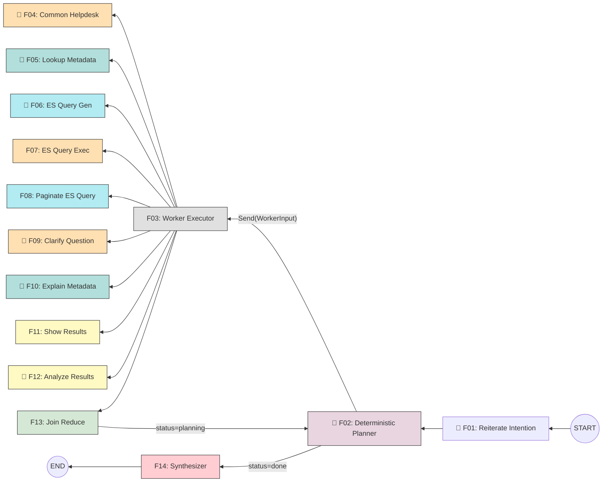
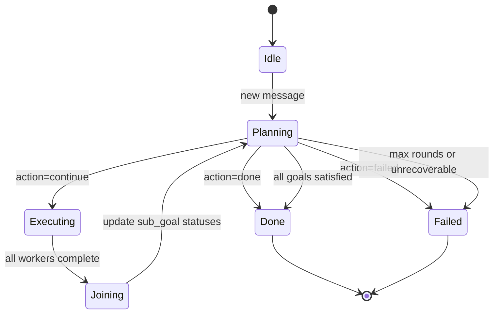
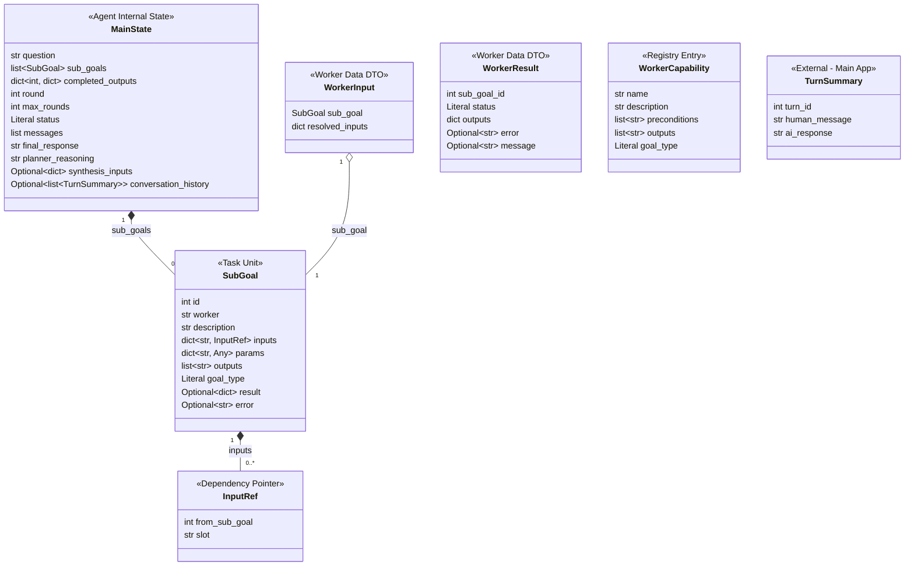
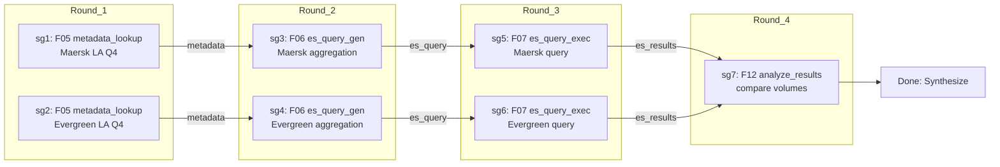

# Multi-Intent Agent: Deterministic Planner Pattern

## Overview

This document describes the architecture for handling multi-intent queries in our maritime business intelligence agent. The system uses a Deterministic Planner pattern with Map/Reduce execution to decompose complex user queries into manageable sub-goals, execute them in parallel where possible, and synthesize results.

## Core Principle

A user submits a single question that may contain **multiple goals** (e.g., "Compare Maersk vs Evergreen volumes to LA and show their average transit times"). The Deterministic Planner (F02) decomposes this into **sub-goals** and drives them to completion through iterative rounds:

1. **Plan** — F02 analyzes the question, checks worker preconditions against available data, and emits a batch of sub-goals for this round
2. **Fan-out** — Sub-goals execute in parallel across worker nodes (F04-F12)
3. **Reduce** — F13 collects all worker results (success, failed, or partial)
4. **Loop** — F13 returns results to F02, which plans the next round of sub-goals based on what succeeded and what's still needed
5. **Done** — When all goals are satisfied, F02 signals completion and the Synthesizer (F14) produces the final response

**Everything inside the loop is fully automated.** There are no human messages between rounds. All messages flowing through the graph are `AIMessage` or `ToolMessage`. The only `HumanMessage` is the initial user question. The planner autonomously handles dependencies (e.g., "can't query without metadata" → issue metadata lookup first), retries on failure, and decides when partial results are acceptable.

## Design Principles

- **No over-engineering** — Simple state machine, explicit wiring, predictable flow
- **Isolated execution** — Workers operate on scoped state, no side effects
- **Incremental planning** — Planner reacts to success/failure each round, not upfront DAG
- **Explicit data flow** — No magic; planner wires outputs to inputs explicitly
- **Fully autonomous loop** — No human intervention between rounds; planner drives all decisions
## Architecture

### High-Level Flow (14-Node Architecture)


> **Note:** F03 (Worker Executor) is a LangGraph node that receives `WorkerInput` via `Send()` payload. Multiple F03 instances run in parallel (one per sub-goal). Each dispatches to the correct worker (F04-F12) based on `sub_goal["worker"]`. On error, F03 wraps the exception into a `WorkerResult(status="failed")`. All results flow through F13 back to F02.

### Node Definitions

| ID | Node Name | LLM | Description |
|----|-----------|-----|-------------|
| F01 | Reiterate Intention | 🧠 | Reads chat history, restates user intent as an executable main goal |
| F02 | Deterministic Planner | 🧠 | Central orchestrator — checks worker preconditions, plans sub-goals each round, decides continue/done/failed |
| F03 | Worker Executor | — | Receives `WorkerInput` via `Send()`, dispatches to the correct worker by name, wraps result |
| F04 | Common Helpdesk | 🧠 | Answers FAQ and general assistance questions |
| F05 | Lookup Metadata | 🧠 | Entity name resolution (LLM), then field metadata + reference value lookup from ES mappings |
| F06 | ES Query Gen | 🧠 | Generates search or aggregation ES query based on `analysis_result.intent_type`; reports field ambiguity |
| F07 | ES Query Exec | — | Executes Elasticsearch queries (no LLM, just runs the query) |
| F08 | Paginate ES Query | — | Handles paginated ES queries with offset/limit |
| F09 | Clarify Question | 🧠 | Generates a markdown clarification message when F02 detects ambiguity (part of the automated response, no human interrupt) |
| F10 | Explain Metadata | 🧠 | Explains mapping fields and data structure to the user |
| F11 | Show Results | — | Template-based rendering of ES query results (no LLM, saves tokens) |
| F12 | Analyze Results | 🧠 | Deep analysis of query results via LLM — used when F02 determines user wants more than a template answer (e.g., comparisons, trends) |
| F13 | Join Reduce | — | Collects all worker results, updates sub-goal statuses, stores outputs, increments round, loops back to F02 |
| F14 | Synthesizer | — | Resolves synthesis_inputs from completed_outputs, assembles the final response |

> **Note:** Fan-out happens via LangGraph `Send("f03_worker_executor", WorkerInput)` in the conditional edge after F02. F13 always loops back to F02 — it is F02 that decides `action=done` → F14, not F13.

### Send and Join (Parallel Execution)

LangGraph's `Send()` fan-out has two distinct mechanisms — the **reducer** and the **downstream node**:

```
  Time ─────────────────────────────────────────────────────────►

  sb1 (1 sec)  │████████│
               │         └──► reducer runs: worker_results = [r1]
               │
  sb2 (1 min)  │                                 │████████████│
               │                                              └──► reducer runs: worker_results = [r1, r2]
               │
               │              (waiting...)                         ALL branches done
               │                                                         │
               │                                                         ▼
               │                                                  F13 runs ONCE
               │                                                  sees [r1, r2]
               │                                                  clears to []
               │                                                         │
               │                                                         ▼
               │                                                  F02 (next round)
```

1. F02 creates sb1, sb2 → `route_after_planner` returns `[Send("f03", input1), Send("f03", input2)]`
2. Both F03 branches run in parallel
3. As each branch finishes, the **reducer** (`worker_results_reducer`) accumulates its result into state
4. **After ALL branches complete**, F13 runs **once** with the full `worker_results` list
5. F13 processes all results, stores outputs, clears `worker_results`, increments round
6. F13 → F02 for the next round

> **Key distinction:** The reducer is a state-level mechanism that runs per-branch. F13 is a graph node that runs once per round after all parallel work is done. F13 always sees the **complete** set of results for that round.

### Graph Topology (State Machine)


| State | Description |
|-------|-------------|
| Idle | Waiting for new user message |
| Planning | F02 Deterministic Planner analyzing and planning sub-goals |
| Executing | F04-F12 Worker nodes executing in parallel |
| Joining | F13 Collecting and reducing worker outputs |
| Done | All sub-goals completed successfully |
| Failed | Unrecoverable error or max rounds exceeded |
## Data Handshake: How Outputs Become Inputs

This section documents the complete data flow from one sub-goal's output to the next sub-goal's input across rounds.

### The InputRef Wiring Pattern

The core mechanism is **InputRef** — a typed pointer from one sub-goal's input to another sub-goal's output slot:

```
InputRef { from_sub_goal: int, slot: str }
```

When F02 creates sub-goals, it wires inputs using InputRefs. For example, `sg2` might declare:
```
inputs: {
    "analysis_result": { from_sub_goal: 1, slot: "analysis_result" },
    "metadata_results": { from_sub_goal: 1, slot: "metadata_results" }
}
```
This tells the graph: "before running sg2, resolve these slots from sg1's completed outputs."

### Step-by-Step Data Flow

```
┌─────────────────────────────────────────────────────────────────────┐
│ ROUND 1                                                             │
│                                                                     │
│ 1. F02 creates sub-goals:                                           │
│    sg1: metadata_lookup (no inputs, status="pending")               │
│    sg2: es_query_gen (inputs from sg1, status="pending")            │
│                                                                     │
│ 2. route_after_planner checks readiness:                            │
│    sg1: no inputs → READY ✓                                         │
│    sg2: needs sg1.analysis_result → sg1 not in completed_outputs    │
│          → NOT READY ✗                                              │
│                                                                     │
│ 3. Hydrate ready sub-goals:                                         │
│    _hydrate_worker_input(sg1, state) → WorkerInput{                 │
│      sub_goal: sg1,                                                 │
│      resolved_inputs: {}  (no inputs to resolve)                    │
│    }                                                                │
│                                                                     │
│ 4. Fan-out: Send("f03_worker_executor", worker_input_for_sg1)       │
│                                                                     │
│ 5. F03 dispatches to metadata_lookup worker                         │
│    Worker returns: WorkerResult{                                    │
│      sub_goal_id: 1,                                                │
│      status: "success",                                             │
│      outputs: {                                                     │
│        "metadata_results": {...},                                   │
│        "value_results": {...},                                      │
│        "analysis_result": {"intent_type": "search", ...}            │
│      }                                                              │
│    }                                                                │
│                                                                     │
│ 6. F03 wraps: {"worker_results": [result]}                          │
│    LangGraph's worker_results_reducer concatenates across branches   │
│                                                                     │
│ 7. F13 (Join Reduce):                                               │
│    - Reads worker_results from state                                │
│    - Updates sg1.status = "success"                                 │
│    - Stores: completed_outputs[1] = {                               │
│        "metadata_results": {...},                                   │
│        "value_results": {...},                                      │
│        "analysis_result": {...}                                     │
│      }                                                              │
│    - Clears worker_results = [] (custom reducer resets)             │
│    - Increments round, sets status = "planning"                     │
│    - Loops back to F02                                              │
│                                                                     │
└─────────────────────────────────────────────────────────────────────┘

┌─────────────────────────────────────────────────────────────────────┐
│ ROUND 2                                                             │
│                                                                     │
│ 1. F02 sees sg1 completed with outputs. Creates new sub-goals       │
│    or lets existing pending sg2 proceed.                            │
│                                                                     │
│ 2. route_after_planner checks readiness:                            │
│    sg2: needs sg1.analysis_result → sg1 IS in completed_outputs     │
│          AND "analysis_result" IS in completed_outputs[1]           │
│          → READY ✓                                                  │
│                                                                     │
│ 3. Hydrate:                                                         │
│    _hydrate_worker_input(sg2, state) → WorkerInput{                 │
│      sub_goal: sg2,                                                 │
│      resolved_inputs: {                                             │
│        "analysis_result": completed_outputs[1]["analysis_result"],  │
│        "metadata_results": completed_outputs[1]["metadata_results"] │
│      }                                                              │
│    }                                                                │
│                                                                     │
│ 4. Fan-out: Send("f03_worker_executor", worker_input_for_sg2)       │
│    Worker reads resolved_inputs to get the actual data.             │
│                                                                     │
│ 5. Continue until F02 declares action="done"...                     │
└─────────────────────────────────────────────────────────────────────┘
```

### Key Functions in the Handshake

| Function | File | Role |
|----------|------|------|
| `_is_sub_goal_ready()` | graph.py:37 | Checks all InputRefs are satisfied in `completed_outputs` |
| `_hydrate_worker_input()` | graph.py:61 | Resolves InputRefs → actual values from `completed_outputs` |
| `route_after_planner()` | graph.py:81 | Conditional edge: checks readiness, hydrates, creates `Send()` objects |
| `worker_results_reducer()` | state.py:15 | Custom reducer: concatenates parallel branch results, clears on empty |
| `F13.ainvoke()` | f13_join_reduce.py:31 | Stores worker outputs in `completed_outputs`, prepares next round |
| `F14.ainvoke()` | f14_synthesizer.py:51 | Resolves `synthesis_inputs` (InputRefs) → final response |

### The completed_outputs Store

`completed_outputs` is the central data store that enables cross-round data flow. It maps `sub_goal_id → { slot_name: value }`. Example after 3 sub-goals complete:

```
completed_outputs = {
    1: { metadata_results: {...}, value_results: [...], analysis_result: {...} },
    2: { es_query: {...}, ambiguity: null },
    3: { es_results: {...}, hit_count: 42 },
}
```

Workers read their inputs from `resolved_inputs` (hydrated by graph.py), produce outputs in `WorkerResult.outputs`, and F13 stores those outputs back into `completed_outputs` for the next round.

### synthesis_inputs (Final Output Wiring)

When F02 declares `action="done"`, it provides `synthesis_inputs` — a dict of InputRefs telling F14 which outputs to include in the final response:

```
synthesis_inputs = {
    "results":  { from_sub_goal: 4, slot: "formatted_results" },
    "analysis": { from_sub_goal: 5, slot: "analysis" }
}
```

F14 resolves these the same way `_hydrate_worker_input` resolves worker inputs — by looking up `completed_outputs[from_sub_goal][slot]`.

## Data Models

> **Note:** `TurnSummary` is **external** to this agent. It is maintained by the main app and represents **one turn**: 1 HumanMessage + 1 AI response. A list of TurnSummary = chat history/memory.

### Class Diagram



#### goal_type

| Type | Meaning | F02 behavior |
|------|---------|-------------|
| `support` | Produces intermediate data for other workers | F02 does NOT count this toward completion |
| `deliverable` | Produces content for the final user response | F02 counts this — when all deliverables are done → `action: done` |

> **Note:** Full type definitions are in [state.py](file:///Users/yingzhou/work/cbp_work/deterministic_planner/app/agent/main_agent4/state.py). The class diagram above is the canonical reference.
### Worker Registry (F04-F12)

All worker nodes are registered declaratively via the `@worker_tool` decorator. F02 uses this registry to check preconditions before dispatching sub-goals. New capabilities can be added by registering new workers — the architecture is designed to be **expandable**.

| Node | Worker Name | LLM | Goal Type | Preconditions | Outputs |
|------|-------------|-----|-----------|---------------|----------|
| F04 | common_helpdesk | 🧠 | deliverable | user query is a common/general question | `answer` |
| F05 | metadata_lookup | 🧠 | support | has entity or reference to look up | `metadata_results`, `value_results`, `analysis_result` |
| F06 | es_query_gen | 🧠 | support | has `metadata_results`, has `analysis_result` with intent_type | `es_query`, `ambiguity` |
| F07 | es_query_exec | — | support | has ES query | `es_results`, `hit_count` |
| F08 | page_query | — | support | has `es_query` with pagination params | `page_results`, `has_more`, `next_offset` |
| F09 | clarify_question | 🧠 | deliverable | planner identified ambiguity requiring clarification | `clarification_message` |
| F10 | explain_metadata | 🧠 | deliverable | has `metadata_results` to explain | `explanation` |
| F11 | show_results | — | deliverable | has `es_results` to display | `formatted_results` |
| F12 | analyze_results | 🧠 | deliverable | has `es_results`, user intent requires analysis | `analysis` |

> The full registry is defined in [worker_registry.py](file:///Users/yingzhou/work/cbp_work/deterministic_planner/app/agent/main_agent4/worker_registry.py) via the `@worker_tool` decorator on each worker's `ainvoke` method.
## Planner Behavior

### Planner Input (Each Round)

Each round, F02 receives: the user question, the full worker registry (with preconditions, outputs, goal_type), completed sub-goals with their outputs, failed sub-goals with their errors, all `completed_outputs` from prior rounds, and the current round number vs. max_rounds.
### Planner Output

The planner responds with exactly one of three actions:

| Action | Meaning | Includes |
|--------|---------|----------|
| `continue` | More work to do — dispatch new sub-goals | `reasoning`, `sub_goals` (with InputRef wiring) |
| `done` | All deliverables satisfied | `reasoning`, `synthesis_inputs` (InputRefs for F14) |
| `failed` | Unrecoverable error | `reasoning` only |
## Scenarios

### Scenario 1: Multi-Intent with Uncertainty Handling
User Query: "what's shipment and find me a shipment arrived yesterday"

This query has 2 goals: (1) simple FAQ, (2) complex query needing metadata lookup.

```
Round 1:
  F01: "You want: (1) What is a shipment? (2) Find shipments arrived yesterday"
  F02 checks preconditions:
    - sg1→F04: FAQ question about "shipment" ✓
    - sg2→F05: need entity resolution + metadata for "shipment arrived yesterday" ✓
  F02: [sg1→F04, sg2→F05]

  sg1→F04: "A shipment is goods being transported from origin to destination..."
  sg2→F05: lookup_metadata("shipment arrived yesterday")
         → Entity "shipment" resolved
         → RAG finds best field: "arrival_date"
         → analysis_result: {intent_type: "search"}
         → outputs: metadata_results, value_results, analysis_result

Round 2:
  F13: Collects results, returns to F02
  F02 checks preconditions:
    - F06 needs metadata_results + analysis_result ✓ (from sg2)
  F02: [sg3→F06: es_query_gen(metadata_results, analysis_result)]

  sg3→F06: Generates ES query for arrival_date search
         → BUT: ambiguity detected — field1 or field2 or both?
         → outputs: {es_query: {...}, ambiguity: "unsure if arrival_date or eta_date"}

Round 3:
  F13: Collects results, returns to F02
  F02 sees ambiguity from F06. Two strategies:

  # Option A: Conservative — ask for clarification
  F02: [sg4→F09: clarify_question(ambiguity details)]
  F09 generates markdown: "I found results but I'm unsure whether you mean
    arrival_date or eta_date. Could you clarify?"

  # Option B: Eager — proceed with best guess
  F02: [sg4→F11: show_results(es_query results using arrival_date)]

Round 4:
  F13: All sub-goals complete
  F02: "All goals exhausted" → action: done

  F14: Synthesizes → ONE AIMessage combining all sub-goal outputs:
  "A shipment is... Here are shipments that arrived yesterday: [list]
   Note: I used arrival_date — did you mean eta_date instead?"

→ Back to Idle, waiting for next query
```

Key behaviors demonstrated:
- **F02 checks preconditions** before each dispatch — F06 can't run until F05 provides metadata
- **F05 does entity resolution (LLM)** then field metadata lookup (ES mapping)
- **F05 outputs `analysis_result`** with `intent_type: "search"` to guide F06
- **F06 reports ambiguity** (field1 vs field2) instead of silently guessing
- **F02 decides** to clarify (F09) or proceed eagerly (F11) based on ambiguity
- **F09 is automated** — generates a clarification message as part of the response, no human pause
- **ONE final AIMessage** exits the agent; user answers clarification in the **next turn**
- **TurnSummary saved externally** by main app (1 HumanMessage + 1 AI response)

---

### Scenario 2: Simple Single-Intent

User Query: "Show me Maersk shipments to Los Angeles"

```
Round 1:
  F02 checks preconditions:
    - es_query_gen needs metadata_results → not available yet
    - metadata_lookup can run ✓
  F02: [sg1→F05: metadata_lookup("Maersk", "Los Angeles")]

  sg1→F05: Entity "Maersk" resolved → shipper_name: "MAERSK"
           Field: "destination_port" → "Los Angeles"
           analysis_result: {intent_type: "search"}
           outputs: {metadata_results, value_results, analysis_result}

Round 2:
  F13: stores sg1 outputs in completed_outputs[1]
  F02 checks preconditions:
    - es_query_gen needs metadata_results ✓ (from sg1)
  F02: [sg2→F06: es_query_gen(
    inputs: {analysis_result: {from: 1, slot: "analysis_result"},
             metadata_results: {from: 1, slot: "metadata_results"}}
  )]

  sg2→F06: Generates search query → outputs: {es_query: {...}}

Round 3:
  F13: stores sg2 outputs in completed_outputs[2]
  F02: [sg3→F07: es_query_exec(
    inputs: {es_query: {from: 2, slot: "es_query"}}
  )]

  sg3→F07: Executes ES query → outputs: {es_results: {...}, hit_count: 15}

Round 4:
  F13: stores sg3 outputs in completed_outputs[3]
  F02: [sg4→F11: show_results(
    inputs: {es_results: {from: 3, slot: "es_results"}}
  )]

  sg4→F11: Renders results as markdown table
           → outputs: {formatted_results: "| shipper | port | ..."}

Round 5:
  F13: stores sg4 outputs in completed_outputs[4]
  F02: All deliverables complete → action: done
       synthesis_inputs: {results: {from: 4, slot: "formatted_results"}}
  F14: Resolves synthesis_inputs → assembles final response
```

### Scenario 3: Multi-Intent Comparison

User Query: "Compare Maersk vs Evergreen shipping volumes to LA last quarter"

```
Round 1:
  F02: [sg1→F05: metadata_lookup("Maersk", "LA", "Q4"),
        sg2→F05: metadata_lookup("Evergreen", "LA", "Q4")]
  (parallel execution — both have no input deps)

Round 2:
  sg1: success → Maersk metadata, analysis_result: {intent_type: "aggregation"}
  sg2: success → Evergreen metadata, analysis_result: {intent_type: "aggregation"}
  F02: [sg3→F06: es_query_gen(inputs from sg1),
        sg4→F06: es_query_gen(inputs from sg2)]
  (parallel — both deps satisfied)

Round 3:
  sg3: success → es_query for Maersk aggregation
  sg4: success → es_query for Evergreen aggregation
  F02: [sg5→F07: es_query_exec(inputs: {es_query: from sg3}),
        sg6→F07: es_query_exec(inputs: {es_query: from sg4})]
  (parallel execution of both queries)

Round 4:
  sg5: success → es_results for Maersk
  sg6: success → es_results for Evergreen
  F02: User wants comparison → dispatch to analyze_results
  F02: [sg7→F12: analyze_results(
    inputs: {es_results: from sg5}  # Note: F12 can only take one es_results input
  )]

Round 5:
  sg7: success → comparison analysis with insights
  F02: action: done
  F14: Synthesizes final comparison response
```



### Scenario 4: Failure with Clarification

User Query: "Show shipments from Acme Corp to Houston"

```
Round 1:
  F02: [sb1→F05: metadata_lookup("Acme Corp", "Houston")]

Round 2:
  sb1: partial → "Multiple matches: Acme Corp LLC, Acme Corporation, Acme Co"
  F02 sees ambiguity → conservative approach, ask user
  F02: [sb2→F09: clarify_question("Which Acme entity did you mean?")]

Round 3:
  sb2: success → clarification_message: "I found multiple matches for Acme Corp:
    1. Acme Corp LLC  2. Acme Corporation  3. Acme Co
    Which one did you mean?"
  F02: No more sub-goals can proceed without user input → action: done

  F14: Synthesizes response including the clarification question
  → Agent returns: "I found multiple matches for Acme Corp... Which one did you mean?"

--- Next Turn (new HumanMessage) ---
User: "Acme Corp LLC"

Round 1:
  F01 reads chat history → "User wants shipments from Acme Corp LLC to Houston"
  F02: [sb1→F05: metadata_lookup("Acme Corp LLC", "Houston")]

...continues normally...
```

### Scenario 5: Partial Success

User Query: "Top 5 shippers to LA and their average transit times"

```
Round 1:
  F02: [sb1→F05: metadata_lookup("shippers", "LA", "transit times")]

Round 2:
  sb1: success → metadata_results, analysis_result: {intent_type: "aggregation"}
  F02: [sb2→F06: es_query_gen(aggregation: top 5 shippers to LA)]

Round 3:
  sb2: success → es_query for aggregation
  F02: User wants analysis (transit times) → needs both es_results and sql data
  F02: [sb3→F07: sql_exec(transit times for top shippers)]

Round 4:
  sb3: partial → "Transit time data available for 3 of 5 shippers"
  F02 evaluates: partial is acceptable for the question
  F02: [sb4→F12: analyze_results(sb2.results, sb3.results)]

Round 5:
  sb4: success → analysis with caveat
  F02: action: done
  F14: "Top 5 shippers to LA: [list]. Average transit times available
        for 3 of 5 shippers: [data]. Note: transit data unavailable for [2 shippers]."
```
> **Implementation:** The full LangGraph graph construction is in [graph.py](file:///Users/yingzhou/work/cbp_work/deterministic_planner/app/agent/main_agent4/graph.py).
## Open Questions for Review
Max rounds - What's a reasonable cap? 5? 10? Should it be configurable per query complexity?

Worker timeout - Individual worker timeout vs. overall query timeout?

Partial success policy - When is partial acceptable? Should planner decide or have explicit rules?

State persistence - Do we checkpoint between rounds for recovery? LangGraph supports this but adds complexity.

Observability - How do we expose the sub_goal DAG to users/debugging? Streamlit visualization?

Expandability - Current 9 workers (F04-F12) cover known use cases. New question types (e.g., query debugging: "why did my query return nothing?") can be added by registering new workers. F02 just needs to know their preconditions and outputs.

## Appendix A: Worker Plugin Template

To add a new worker node, follow this contract:

### 1. Register in WORKER_REGISTRY

```python
{
    "name": "your_worker_name",           # unique identifier, used as SubGoal.worker
    "description": "What this worker does — be specific so F02 can match it to user intent",
    "preconditions": [
        "has X from another worker",      # what data must exist before F02 can dispatch this
        "user intent requires Y"          # when should F02 choose this worker
    ],
    "outputs": ["output_slot_1", "output_slot_2"],  # slot names other workers can reference
    "goal_type": "support"                # "support" = intermediate data, "deliverable" = user-facing content
}
```

### 2. Implement the worker function

```
Input:  WorkerInput { sub_goal: SubGoal, resolved_inputs: dict[str, Any] }
Output: WorkerResult { sub_goal_id, status, outputs, error, message }
```

Rules:
- **Stateless** — receives `WorkerInput`, returns `WorkerResult`. No side effects.
- **Try/catch decorator** — the framework wraps your function. On unhandled exception, returns `WorkerResult(status="failed", error=str(e))` automatically.
- **Output slot names must match** what you declared in `outputs` of your registry entry.
- **`message` field** — optional human-readable explanation. F02 reads this to decide next steps (e.g., "ambiguity: field1 or field2").
- **No overlap** — your worker should do ONE thing that no other worker does. Check the registry before adding.

### 3. Non-overlap checklist

Before adding a new worker, verify:
- [ ] No existing worker already handles this use case
- [ ] Preconditions are distinct from other workers (F02 should never be confused about which to pick)
- [ ] Output slot names don't collide with other workers
- [ ] `goal_type` is correct — `support` if it produces data for other workers, `deliverable` if it produces content for the final response

### 4. Add to the flow

- Add a `Send` edge from F02 to your new node in the mermaid diagram
- Add a return edge from your node to F13
- Update the node definitions table

## Appendix B: Planner Prompt Template
See the system prompt in [f02_deterministic_planner.py](file:///Users/yingzhou/work/cbp_work/deterministic_planner/app/agent/main_agent4/nodes/f02_deterministic_planner.py).
