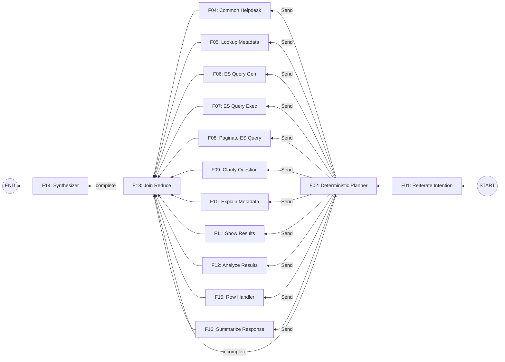

# Node Design Documents Index

This directory contains detailed design documents for each node in the 16-node Deterministic Planner architecture.

## Node Overview

| ID | Node | Type | Purpose |
|----|------|------|---------|
| F01 | Reiterate Intention | 🧠 LLM | Entry point - reads chat history, restates user intent |
| F02 | Deterministic Planner | 🧠 LLM | Central orchestrator - plans sub-goals, decides continue/done/failed |
| F03 | Worker Executor | — Non-LLM | Dispatches to correct worker based on sub_goal["worker"] |
| F04 | Common Helpdesk | 🧠 LLM | Answers FAQ and general assistance questions |
| F05 | Lookup Metadata | 🧠 LLM | Entity resolution + field metadata lookup from ES |
| F06 | ES Query Gen | 🧠 LLM | Generates ES search/aggregation queries |
| F07 | ES Query Exec | — Non-LLM | Executes Elasticsearch queries |
| F08 | Paginate ES Query | — Non-LLM | Handles paginated ES queries |
| F09 | Clarify Question | 🧠 LLM | Generates clarification messages for ambiguity |
| F10 | Explain Metadata | 🧠 LLM | Explains field mappings to users |
| F11 | Show Results | — Non-LLM | Template-based result rendering |
| F12 | Analyze Results | 🧠 LLM | Deep LLM analysis (comparisons, trends) |
| F13 | Join Reduce | — Non-LLM | Collects worker results, routes to next step |
| F14 | Synthesizer | — Non-LLM | Assembles final response from deliverables |
| F15 | Row Handler | — Non-LLM | Processes individual rows/records |
| F16 | Summarize Response | 🧠 LLM | Creates concise summary of final response |

## Flow Diagram

## Node Categories

### Entry/Exit Nodes
- **F01**: Reiterate Intention - Entry point
- **F14**: Synthesizer - Exit point (final response)
- **F16**: Summarize Response - Optional exit helper

### Orchestration Nodes
- **F02**: Deterministic Planner - Central brain
- **F03**: Worker Executor - Dispatches to workers
- **F13**: Join Reduce - Collection point

### Support Workers (produce intermediate data)
- **F05**: Lookup Metadata
- **F06**: ES Query Gen
- **F07**: ES Query Exec
- **F08**: Paginate ES Query
- **F15**: Row Handler

### Deliverable Workers (produce user-facing content)
- **F04**: Common Helpdesk
- **F09**: Clarify Question
- **F10**: Explain Metadata
- **F11**: Show Results
- **F12**: Analyze Results

## LLM vs Non-LLM Distribution

| Type | Count | Nodes |
|------|-------|-------|
| 🧠 LLM | 9 | F01, F02, F04, F05, F06, F09, F10, F12, F16 |
| — Non-LLM | 7 | F03, F07, F08, F11, F13, F14, F15 |

## goal_type Distribution

| Type | Meaning | Nodes |
|------|---------|-------|
| support | Intermediate data for other workers | F05, F06, F07, F08, F15 |
| deliverable | User-facing content | F04, F09, F10, F11, F12 |

## Document Files

1. [F01_reiterate_intention.md](F01_reiterate_intention.md)
2. [F02_deterministic_planner.md](F02_deterministic_planner.md)
3. [F03_worker_executor.md](F03_worker_executor.md)
4. [F04_common_helpdesk.md](F04_common_helpdesk.md)
5. [F05_lookup_metadata.md](F05_lookup_metadata.md)
6. [F06_es_query_gen.md](F06_es_query_gen.md)
7. [F07_es_query_exec.md](F07_es_query_exec.md)
8. [F08_page_query.md](F08_page_query.md)
9. [F09_clarify_question.md](F09_clarify_question.md)
10. [F10_explain_metadata.md](F10_explain_metadata.md)
11. [F11_show_results.md](F11_show_results.md)
12. [F12_analyze_results.md](F12_analyze_results.md)
13. [F13_join_reduce.md](F13_join_reduce.md)
14. [F14_synthesizer.md](F14_synthesizer.md)
15. [F15_row_handler.md](F15_row_handler.md)
16. [F16_summarize_response.md](F16_summarize_response.md)
